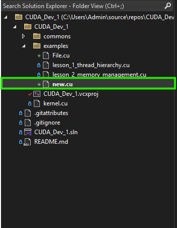
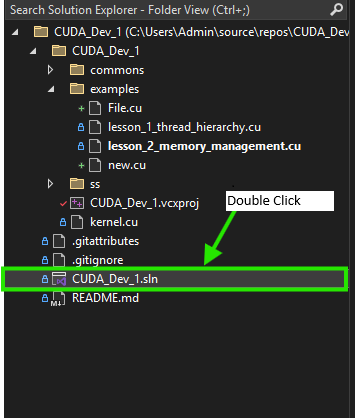
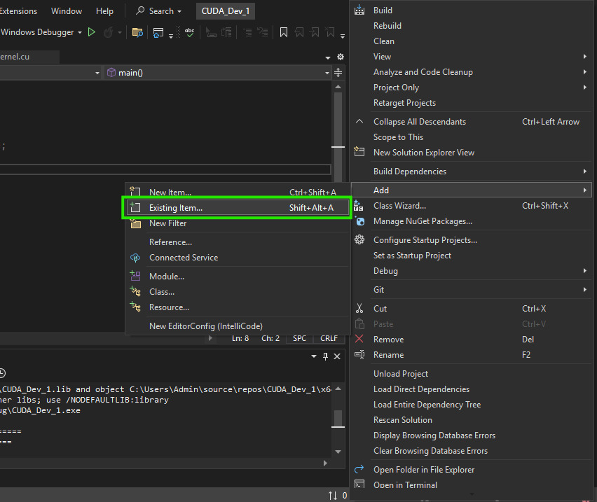
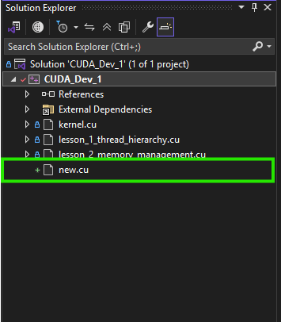

# CUDA_Dev_1: CUDA Programming Learning Repository

## Overview
This repository, `CUDA_Dev_1`, is a collection of CUDA programming lessons designed to learn and demonstrate GPU programming concepts using NVIDIA's CUDA platform. Each lesson is implemented as a separate `.cu` file in the `examples/` directory, focusing on core CUDA topics such as thread hierarchy, memory management, and more. The project uses **preprocessor definitions** to selectively compile individual lessons, ensuring clean and conflict-free execution despite multiple `main` functions.

This repository is integrated with Visual Studio 2022 for development and GitHub for version control, showcasing industry-standard practices for project organization and build management.

[](https://developer.nvidia.com/cuda-zone)

[](https://visualstudio.microsoft.com/)


## Project Structure
The repository is organized as follows:

```
CUDA_Dev_1/
├── .gitattributes          # Git attributes for consistent line endings
├── .gitignore             # Ignores build artifacts and Visual Studio files
├── README.md              # This file
├── CUDA_Dev_1.sln         # Visual Studio solution file
├── CUDA_Dev_1/            # Project directory
│   ├── CUDA_Dev_1.vcxproj # Visual Studio project file
│   ├── CUDA_Dev_1.vcxproj.user # User-specific settings
│   ├── examples/          # Directory for lesson files
│   │   ├── hello_world.cu # Basic CUDA hello world example
│   │   ├── thread_hierarchy.cu # Lesson on CUDA thread hierarchy
│   │   ├── memory_management.cu # Lesson on CUDA memory management
│   │   └── (other lesson .cu files)
│   ├── common/            # Shared utilities (optional)
│   │   ├── utils.h        # Header for common functions/macros
│   │   └── utils.cu       # Implementation of common functions
│   └── x64/               # Build output directory (ignored by Git)
```

## Prerequisites
To build and run the lessons in this repository, ensure you have the following installed:
- **Visual Studio 2022** with the "Desktop development with C++" workload.
- **NVIDIA CUDA Toolkit** (version 12.3 or later recommended) installed and configured with Visual Studio.
- An NVIDIA GPU compatible with the installed CUDA Toolkit version.
- Git for version control (optional, for cloning the repository).

## Setup Instructions
Follow these steps to set up and run the project in Visual Studio 2022:

1. **Clone the Repository**:
   ```bash
   git clone https://github.com/your-username/CUDA_Dev_1.git
   cd CUDA_Dev_1
   ```

2. **Open the Project**:
   - Open `CUDA_Dev_1.sln` in Visual Studio 2022.
   - Ensure the solution configuration is set to `Debug` or `Release` and the platform is `x64`.

3. **Configure Preprocessor Definitions**:
   - This project uses preprocessor definitions to select which lesson to compile, avoiding conflicts between multiple `main` functions.
   - Right-click the `CUDA_Dev_1` project in **Solution Explorer** and select **Properties**.
   - Navigate to **Configuration Properties > CUDA C/C++ > Host > Preprocessor Definitions**.
   - Add one of the following definitions based on the lesson you want to run:
     - `LESSON_HELLO_WORLD=1` for `hello_world.cu`
     - `LESSON_THREAD_HIERARCHY=1` for `thread_hierarchy.cu`
     - `LESSON_MEMORY_MANAGEMENT=1` for `memory_management.cu`
   - Click **Apply** and **OK**.
   - **Note**: Ensure only one lesson’s preprocessor definition is set at a time to avoid conflicts.

4. **Build and Run**:
   - Press `F5` or select **Build > Build Solution** to compile and run the selected lesson.
   - The output will appear in the Visual Studio console or a command-line window, depending on the lesson.

5. **Switching Lessons**:
   - To run a different lesson, update the preprocessor definition in the project properties (step 3) to match the desired lesson’s macro (e.g., `LESSON_THREAD_HIERARCHY=1`).
   - Rebuild the project to compile the new lesson.

## Example: Running a Lesson
To run the `hello_world.cu` lesson:
1. Set the preprocessor definition to `LESSON_HELLO_WORLD=1` in the project properties.
2. Build and run the project (`F5`).
3. The program will output: `Hello, World from CUDA!`.

## Adding New Lessons
To add a new lesson:
1. Create a new `.cu` file in the `examples/` directory (e.g., `new_lesson.cu`).
2. Wrap the `main` function in a unique preprocessor directive, e.g.:
   ```cuda
   #ifdef LESSON_NEW_LESSON
   #include <stdio.h>
   #include <cuda_runtime.h>
   int main() {
       printf("New CUDA Lesson!\n");
       return 0;
   }
   #endif
   ```
3. Add the file to the Visual Studio project: **Solution Explorer > Right-click project > Add > Existing Item** > Select `new_lesson.cu`.
4. Set the preprocessor definition to `LESSON_NEW_LESSON=1` in project properties.
5. Build and run.

## Screenshots
Add the file created in the `examples/` directory to the project:<br>

 <br>

<br>
 <br>


1. 
## Notes
- **Preprocessor Definitions**: Each `.cu` file in `examples/` has its `main` function wrapped in a unique preprocessor directive (e.g., `#ifdef LESSON_HELLO_WORLD`). This ensures only one `main` function is compiled at a time, preventing linker errors.
- **Common Utilities**: The `common/` directory contains shared code (e.g., `utils.h`, `utils.cu`) for reusable functions like CUDA error checking or timing utilities.
- **Version Control**: The repository is designed for GitHub, with `.gitignore` excluding build artifacts (`x64/`, `*.obj`, `*.exe`, etc.).
- **Debugging**: Use Visual Studio’s debugger or NVIDIA’s `cuda-gdb` for debugging. Enable GPU debug info in **Properties > CUDA C/C++ > Device > Generate GPU Debug Information**.

## Contributing
This repository is a personal learning project, but contributions or suggestions are welcome! Please open an issue or submit a pull request on GitHub.

